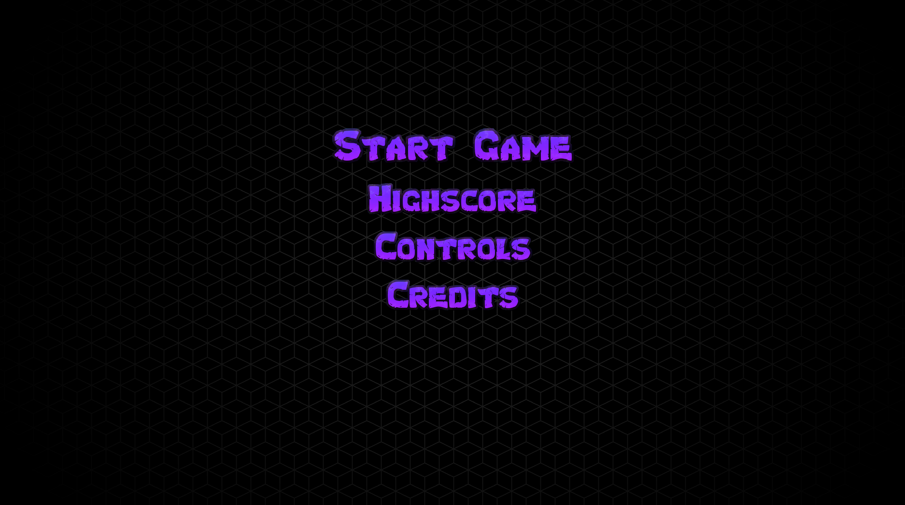
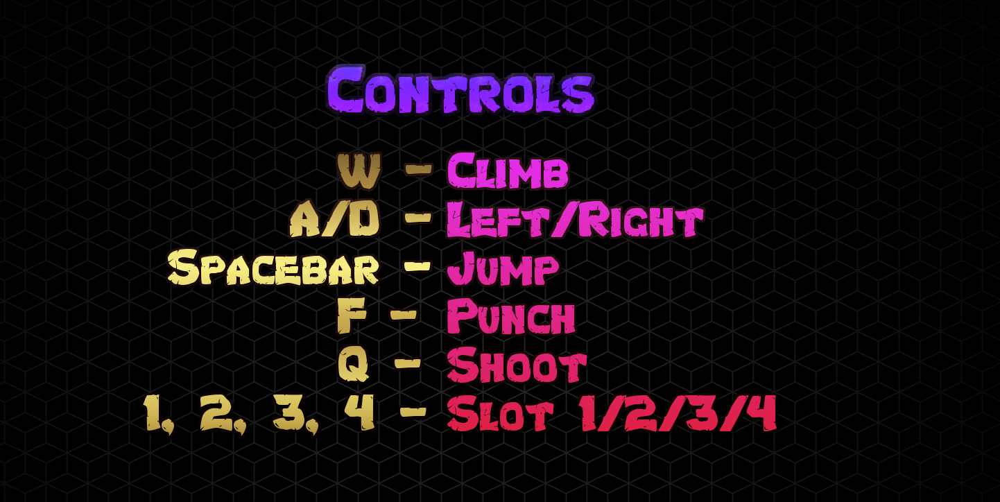
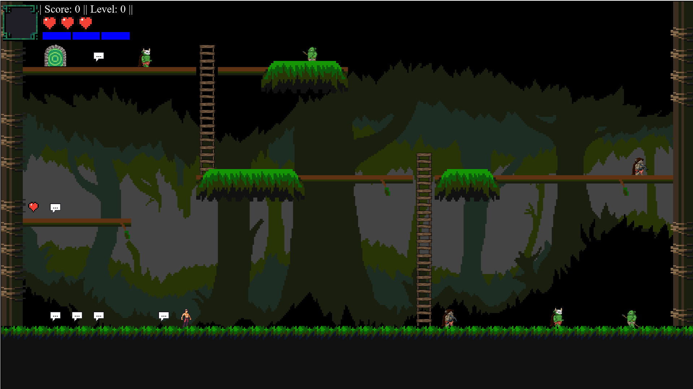
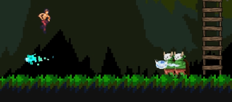
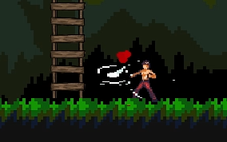
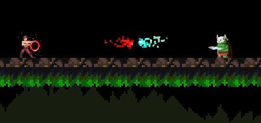

# Dream Dimension

This was my first ever coding project, developed in my 1st Year of University in a team of 4 students. It marked my introduction to software development and game programming, and was a key step in building my interest in computer science.

## The Game

A 2D dungeon-crawler game developed in Python using Pygame. Players explore interconnected rooms, battle enemies, unlock new abilities, and progress through increasingly difficult levels while managing health, mana, and score.

## Features

* Real-time player movement and combat
* Multiple enemy types with unique behaviours
* Projectile-based attacks
* Health and mana management systems
* Score and progression tracking
* Interactive portals for room and level transitions
* Menu system including story, controls, high scores, and credits
* JSON-driven map generation

## Technologies Used

* Python
* Pygame
* JSON

## Architecture

The project follows an object-oriented design where all game objects inherit from a shared `Entity` base class. The `GameState` class manages the game loop, rendering, entity updates, and UI transitions.

Maps are generated from JSON room definitions, allowing game layouts to be modified without changing source code. Collision handling, combat systems, animations, and game state management are separated into dedicated modules to improve maintainability and extensibility.

## My Contribution

This project was originally developed as part of a team project. I was responsible for a significant portion of the game's architecture and gameplay systems, including:

* Core entity system design
* Player and enemy behaviour
* Collision and interaction systems
* Combat and projectile mechanics
* Effects and animation systems
* Game state management
* Map and room transition functionality

## Installation

### Install python

*This project was originally developed using Python 3.10*

> https://www.python.org/downloads/release/python-31011/


### Clone the repository

```bash
git clone https://github.com/A-Alkozai/dream-dimension.git
cd dream-dimension
```

### Install dependencies

```bash
pip install -r requirements.txt
```

### Run the game

```bash
python main.py
```

## Screenshots

### Main Menu



### Controls



### Map



### Combat





## What I Learned

Through this project I gained experience with:

* Object-oriented software design
* Game architecture and state management
* Collision detection systems
* Event-driven programming
* Team-based software development
* Building reusable and modular code
* Managing larger codebases across multiple files and systems

## Future Improvements

* Additional enemy types
* Boss encounters
* Save and load functionality
* Improved animations and visual effects
* Expanded level generation
* Additional weapons and abilities

## Repository Structure

```text
main.py                 # Entry point
GameState.py            # Game loop and state management
entity.py               # Base entity class
player.py               # Player behaviour and controls
enemy.py                # Enemy behaviour
projectile.py           # Projectile mechanics
interaction.py          # Collision handling
map.py                  # Map generation
map.json                # Room layout definitions
effects.py              # Visual effects
portal.py               # Room transitions
scorecounter.py         # Score tracking
healthbar.py            # Health display
mana_bar.py             # Mana display
```
